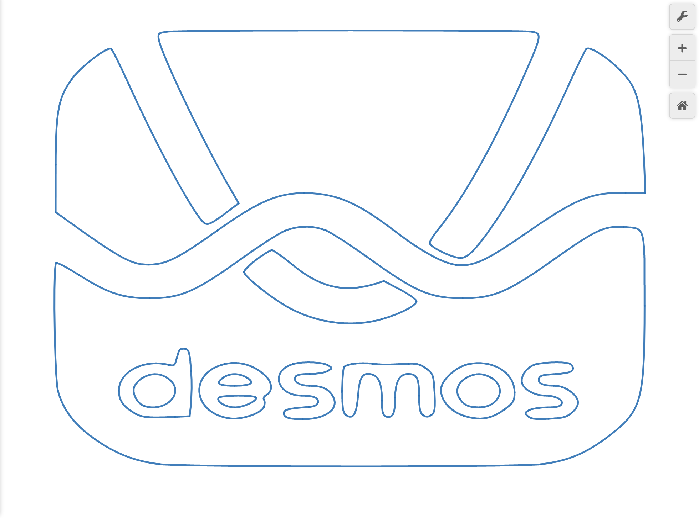

# Desmos SVG Renderer

## Requirements

1. Node.js

## Installation

1. Clone this repo
2. Type `npm install` or `yarn install` \(for Yarn only\)

## Usage

1. Use a tool like `ffmpeg` to split a video into individual frames
2. Put the frames into `in/` \(must be .png, .jpeg, .jpg, adding more soon\)
3. Run `npm start` or `yarn start` \(for Yarn only\)
4. Go to `localhost:8000`
5. Open up the console \(supposed to be `F12`\) and type `renderFrame()`

## Example

## Important Notices

If you put an image in `in/` and run `server/traceFrame.js` multiple times, there may be strange problems with some edges being removed by `jimp` \(library used for increasing contrast\)
Before:

After:

